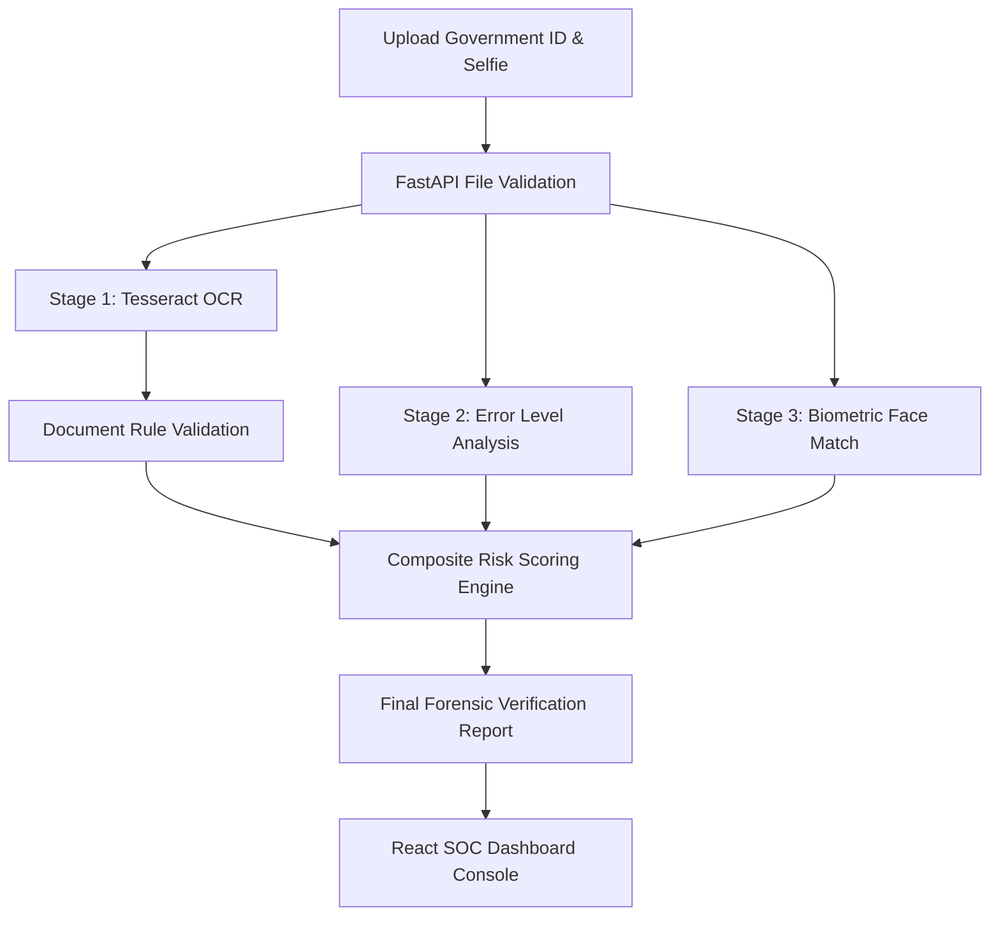

# NETRA / TrustID AI — Verification Console & Biometrics Screening System

[](https://fastapi.tiangolo.com)
[](https://react.dev)
[](https://vite.dev)
[](https://tailwindcss.com)

**NETRA / TrustID AI** is an enterprise-grade AI security platform for government identity document authenticity verification, biometric facial validation, digital tampering detection, and automated risk scoring.

---

## 🏛️ Repository Architecture

This repository is structured cleanly with completely decoupled frontend and backend services:

```
Netra-TrustID/
├── backend/                   # Standalone Python / FastAPI Microservice
│   ├── app/
│   │   ├── api/               # Versioned REST controllers (/health, /api/v1/verify-document)
│   │   ├── core/              # Pydantic settings, CORS policies, logging
│   │   ├── schemas/           # Pydantic request/response data contracts
│   │   ├── services/          # OCR, validation, tampering (ELA), face match, risk scoring
│   │   ├── utils/             # File validation & scoring helpers
│   │   └── main.py            # FastAPI application factory
│   ├── .env.example           # Environment template
│   ├── Dockerfile             # Production container definition
│   └── requirements.txt       # Python dependencies
│
├── frontend/                  # Standalone React 19 + Vite 8 Web Client
│   ├── public/                # Favicons, vector assets
│   ├── src/
│   │   ├── api/               # Centralized HTTP client & verification API calls
│   │   ├── components/
│   │   │   ├── common/        # Shared primitives (Panel, ResultCard, ModuleCard)
│   │   │   ├── dashboard/     # Forensic panels (OCR, ELA, Face, Risk Gauge, Timeline)
│   │   │   ├── face-detector/ # Client-side webcam detector component & CSS
│   │   │   └── layout/        # Sidebar and Topbar navigation
│   │   ├── constants/         # Thresholds, status mappings & API URLs
│   │   ├── engine/            # Pure JS FaceDetectorEngine (face-api.js driver)
│   │   ├── hooks/             # Custom hooks (useDocumentVerification, useFaceDetector)
│   │   ├── utils/             # Data transformation mappers & formatters
│   │   ├── App.jsx            # High-level shell & orchestrator
│   │   └── index.css          # Design tokens & Tailwind CSS v4 rules
│   ├── package.json           # Frontend dependencies & build scripts
│   └── vite.config.js         # Vite bundler configuration with backend proxy
│
├── docs/                      # Architectural & API Documentation
│   ├── ARCHITECTURE.md        # Comprehensive pipeline workflow & design decisions
│   └── API_SPECIFICATION.md   # Complete REST endpoint contract definitions
│
├── docker-compose.yml         # Containerized local development & deployment
├── package.json               # Monorepo scripts
└── .gitignore                 # Root ignore rules
```

---

## 🚀 Quick Start Guide

### Prerequisites
- **Node.js**: v18.0+ (v20+ recommended)
- **Python**: v3.10+
- **Tesseract OCR** (optional, recommended for physical OCR):
  - Ubuntu/Debian: `sudo apt-get install tesseract-ocr`
  - macOS: `brew install tesseract`
  - Windows: Download installer from [UB-Mannheim/tesseract](https://github.com/UB-Mannheim/tesseract/wiki)

---

### 1. Backend Setup (FastAPI)

```bash
cd backend

# Create virtual environment
python -m venv venv

# Activate virtual environment
# Windows:
venv\Scripts\activate
# macOS/Linux:
source venv/bin/activate

# Install dependencies
pip install -r requirements.txt

# Start FastAPI server
uvicorn app.main:app --reload --port 8000
```
- API Endpoint: `http://localhost:8000`
- Interactive Swagger Docs: `http://localhost:8000/docs`
- Health Check: `http://localhost:8000/health`

---

### 2. Frontend Setup (React + Vite)

```bash
cd frontend

# Install packages
npm install

# Start Vite development server
npm run dev
```
- Web Application: `http://localhost:5173`

---

### 3. Running via Docker Compose

To start both services simultaneously in containers:
```bash
docker-compose up --build
```

---

## 🔬 Forensic Verification Pipeline



1. **OCR Extraction**: Extracts text, detects document type (Passport, Driving Licence, Aadhaar, PAN), identifies document number, name, and DOB.
2. **Rule Validation**: Ensures mandatory fields exist, checks OCR confidence, and verifies chronological DOB plausibility.
3. **Tampering Detection (ELA)**: Recompresses at 90% JPEG quality to detect copy-paste or localized manipulation.
4. **Biometric Face Verification**: Compares extracted face photo against the user's reference selfie using facial geometry and embeddings.
5. **Multi-Factor Risk Scoring**: Calculates weighted risk (30% Validation + 40% Tampering + 30% Face Match) to categorize as **Approve**, **Manual Review**, or **Reject**.
